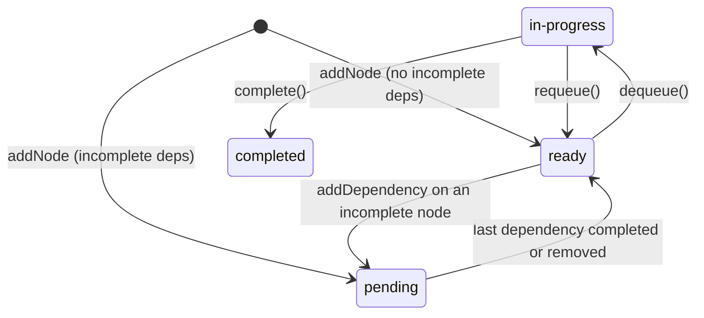

# p-graph

A **dynamic priority graph** for TypeScript: a priority queue whose items can depend on each other.

- A node is handed out only after all of its dependencies have completed. Ready nodes come out **highest priority first** (ties in insertion order).
- The graph is **fully dynamic**. You can add nodes, add or remove dependencies, change priorities and remove nodes at any time, including in the middle of a traversal.
- **Incremental persistence:** every mutation emits a small batch of per-node and per-edge changes to an injected store, so you can keep the graph in SQL, a JSON document, a key-value store or anything else, writing only what changed. The library never serializes anything itself.
- Optional **priority inheritance**, so prerequisites of urgent work run first.
- Cycle detection, strict TypeScript types, ESM, and zero runtime dependencies.

```sh
npm install github:altinokdarici/p-graph
```

## Quick start

```ts
import { PriorityGraph } from "@altinokdarici/p-graph";

const graph = new PriorityGraph<{ title: string }>();

graph.addNode("design", { title: "Design" }, { priority: 5 });
graph.addNode("build", { title: "Build" }, { priority: 3, dependsOn: ["design"] });
graph.addNode("docs", { title: "Docs" }, { priority: 1 });

for (const node of graph.traverse()) {
  console.log(node.id); // design, build, docs

  // The graph can grow while you walk it.
  if (node.id === "design") {
    graph.addNode("review", { title: "Review" }, { priority: 4, dependsOn: ["design"] });
  }
}
```

`traverse()` dequeues the best ready node and marks it `completed` when you move on to the next one. For finer control, use the queue methods directly:

```ts
const node = graph.dequeue(); // highest-priority ready node, now "in-progress"
if (node) {
  // ...do the work, possibly asynchronously, possibly adding more nodes...
  const unblocked = graph.complete(node.id); // ids that just became ready
  // or graph.requeue(node.id) to retry later
}
```

## Node lifecycle



- `pending`: waiting for at least one dependency.
- `ready`: in the priority queue.
- `in-progress`: handed out by `dequeue()`.
- `completed`: done. A dependency on a completed node counts as already satisfied.

Only nodes that have not started (`pending` or `ready`) can gain new dependencies. Adding an edge that would create a cycle throws a `CycleError` that names the cycle.

## Priority inheritance

```ts
const graph = new PriorityGraph({ inheritPriority: true });
graph.addNode("other", null, { priority: 5 });
graph.addNode("prereq", null, { priority: 1 });
graph.addNode("urgent", null, { priority: 10, dependsOn: ["prereq"] });

[...graph.traverse()].map((n) => n.id); // ["prereq", "urgent", "other"]
```

With `inheritPriority`, a node's `effectivePriority` is the maximum of its own priority and the effective priority of every node that depends on it. It updates automatically as priorities and edges change.

## Persistence

Pass a `store` to the graph. It receives one batch of `GraphChange`s per mutating call, which makes each batch a natural transaction:

```ts
type GraphChange<T> =
  | { type: "node-added"; node: NodeRecord<T> }
  | { type: "node-updated"; node: NodeRecord<T>; fields: ("data" | "priority" | "state")[] }
  | { type: "node-removed"; id: string }
  | { type: "dependency-added"; id: string; dependsOn: string }
  | { type: "dependency-removed"; id: string; dependsOn: string };

interface NodeRecord<T> { id: string; data: T; priority: number; state: NodeState; order: number }
```

- Each node is a self-contained record, and each edge is a `{ id, dependsOn }` record. They map one-to-one to rows in a `nodes` table and a `dependencies` table.
- Your store decides how to encode the node's `data` (a JSON column, separate columns, a blob, ...).
- When a node is removed, its edges are removed first, so foreign keys stay valid.
- `apply` may be synchronous or return a promise. Batches are always delivered in order and one at a time. `await graph.flush()` waits until all of them have been applied.
- If the store throws or rejects, the graph records a `StoreError` (`graph.storeError`), rejects `flush()`, and refuses further mutations, so it never silently drifts from storage. Reload it from the store to recover.

### Example: SQL store

```ts
import type { GraphChange, GraphStore } from "@altinokdarici/p-graph";

// CREATE TABLE nodes (id TEXT PRIMARY KEY, data TEXT, priority REAL, state TEXT, "order" INTEGER);
// CREATE TABLE dependencies (id TEXT REFERENCES nodes(id), depends_on TEXT REFERENCES nodes(id),
//                            PRIMARY KEY (id, depends_on));

class SqlStore<T> implements GraphStore<T> {
  constructor(private readonly db: Database) {}

  async apply(changes: readonly GraphChange<T>[]) {
    await this.db.transaction(async (tx) => {
      for (const change of changes) {
        switch (change.type) {
          case "node-added": {
            const { id, data, priority, state, order } = change.node;
            await tx.run(
              `INSERT INTO nodes (id, data, priority, state, "order") VALUES (?, ?, ?, ?, ?)`,
              [id, JSON.stringify(data), priority, state, order],
            );
            break;
          }
          case "node-updated": {
            const { id, data, priority, state } = change.node;
            await tx.run(`UPDATE nodes SET data = ?, priority = ?, state = ? WHERE id = ?`, [
              JSON.stringify(data), priority, state, id,
            ]);
            break;
          }
          case "node-removed":
            await tx.run(`DELETE FROM nodes WHERE id = ?`, [change.id]);
            break;
          case "dependency-added":
            await tx.run(`INSERT INTO dependencies (id, depends_on) VALUES (?, ?)`, [change.id, change.dependsOn]);
            break;
          case "dependency-removed":
            await tx.run(`DELETE FROM dependencies WHERE id = ? AND depends_on = ?`, [change.id, change.dependsOn]);
            break;
        }
      }
    });
  }
}
```

Use `change.fields` if you only want to write the columns that changed.

### Example: JSON document store

`applyChanges` applies a batch to a `GraphSnapshot` in place, which is all a whole-document store needs:

```ts
import { applyChanges, type GraphChange, type GraphSnapshot, type GraphStore } from "@altinokdarici/p-graph";
import { writeFileSync } from "node:fs";

class JsonFileStore<T> implements GraphStore<T> {
  constructor(
    private readonly path: string,
    private readonly document: GraphSnapshot<T> = { version: 1, nodes: [], dependencies: [] },
  ) {}

  apply(changes: readonly GraphChange<T>[]) {
    applyChanges(this.document, changes);
    writeFileSync(this.path, JSON.stringify(this.document));
  }
}
```

You can also skip incremental writes and save `graph.toSnapshot()` whenever you like.

### Loading

Rebuild a `GraphSnapshot` from storage and restore it:

```ts
const graph = PriorityGraph.fromSnapshot(
  { version: 1, nodes: rows.map(toNodeRecord), dependencies: edgeRows },
  { store: new SqlStore(db), inheritPriority: true },
);
```

`pending`/`ready` states and effective priorities are derived from the dependencies, so a stale stored value for them is corrected on load. The snapshot is validated: unknown references, duplicate ids or orders, cycles, and started nodes with incomplete dependencies all throw. Loading itself does not emit changes.

## API

| Member | Description |
| --- | --- |
| `new PriorityGraph<T>(options?)` | Options: `inheritPriority` (default `false`), `defaultPriority` (default `0`), `store`. |
| `PriorityGraph.fromSnapshot(snapshot, options?)` | Restores a graph. |
| `addNode(id, data, { priority?, dependsOn? })` | Adds a node. Dependencies must already exist. |
| `removeNode(id)` | Removes a node and its edges. Its dependents stop waiting on it. |
| `pruneCompleted()` | Removes all completed nodes. Returns how many were removed. |
| `setPriority(id, priority)` / `setData(id, data)` | Updates a node. |
| `addDependency(id, dependsOn)` / `removeDependency(id, dependsOn)` | Edits edges. |
| `peek()` | The next ready node, without dequeuing it. |
| `dequeue()` | Takes the next ready node and marks it `in-progress`. |
| `complete(id)` | Completes an `in-progress` node. Returns the ids of nodes that became ready. |
| `requeue(id)` | Puts an `in-progress` node back into the queue. |
| `traverse()` | Generator over ready nodes that completes each one as you go. It sees changes made during the loop. If you leave the loop early, the current node stays `in-progress`. |
| `get(id)`, `has(id)`, `nodes(state?)`, `count(state?)`, `size`, `isComplete` | Queries. |
| `dependenciesOf(id)`, `dependentsOf(id)` | Edge queries. |
| `toSnapshot()` | Plain-object copy of the whole graph. |
| `flush()` | Resolves when the store has applied every batch. |
| `storeError` | The `StoreError` that stopped the graph, if any. |
| `applyChanges(snapshot, changes)` | Applies a change batch to a snapshot in place. |

Errors: `PriorityGraphError` is the base class of `NodeNotFoundError`, `DuplicateNodeError`, `CycleError`, `InvalidStateError`, `InvalidSnapshotError` and `StoreError`.

### Complexity

With `n` nodes: `dequeue`, `requeue`, `setPriority` and making a node ready are O(log n). `complete(id)` costs O(d log n) for `d` dependents. `addDependency` runs a cycle check over the nodes reachable through dependencies; it skips completed nodes. With `inheritPriority`, changes propagate only as far as effective priorities actually change.

## Development

```sh
npm install
npm test          # vitest
npm run typecheck
npm run build     # emits ESM + .d.ts to dist/
```

## License

MIT
